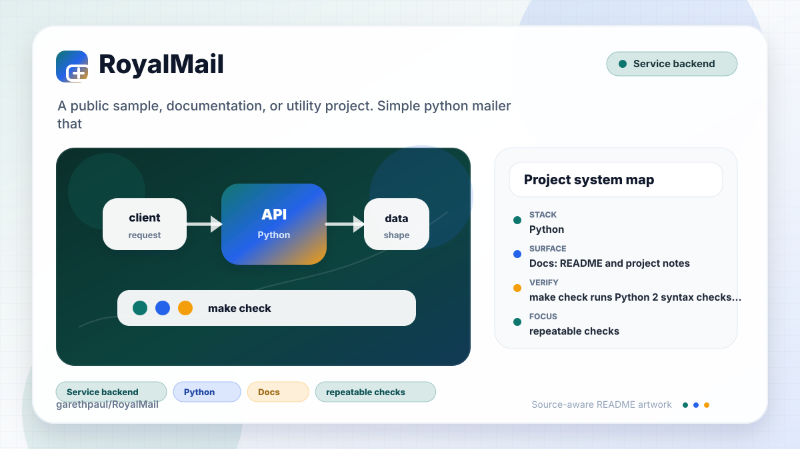

# RoyalMail

<!-- README-OVERVIEW-IMAGE -->


## Overview

`garethpaul/RoyalMail` is a public sample, documentation, or utility project. Simple python mailer that sits on SMTPLIB

This README is based on the checked-in source, manifests, scripts, and repository metadata on the `master` branch. The project language mix found during review was: Python (1).

## Repository Contents

- `README.md` - project overview and local usage notes
- `CHANGES.md` - maintenance history for test and verification coverage
- `Makefile` - local verification entry points
- `docs/plans` - completed maintenance plans for the current baseline
- `plans` - historical implementation notes
- `scripts` - documentation-plan validators
- `tests` - Python 2 unit tests for email composition and sender behavior
- `royalmail.py` - email composition and SMTP sender implementation
- `SECURITY.md` - security reporting and disclosure guidance
- `VISION.md` - project direction and maintenance guardrails

Additional scan context:

- Source directories: no top-level source directories detected
- Dependency and build manifests: none detected
- Entry points or build surfaces: none detected
- Test-looking files: tests/test_royalmail.py

## Getting Started

### Prerequisites

- Git

### Setup

```bash
git clone https://github.com/garethpaul/RoyalMail.git
cd RoyalMail
```

The setup commands above are derived from repository files. Legacy mobile, Python, or JavaScript samples may require older SDKs or package versions than a modern workstation uses by default.

## Running or Using the Project

- No single runtime entry point was identified. Start by reading the source files and manifests listed above.

## Testing and Verification

- `make check` runs Python 2 syntax checks and unit tests for plain text, HTML,
  attachment, envelope, header-injection rejection, SMTP cleanup, and manager
  behavior, including no-argument sender exception recording and attachment
  file cleanup when MIME construction fails. Attachment tests also cover
  constructor-supplied `(filename, cid, mimetype)` tuples and Content-ID
  newline rejection, plus explicit attachment mimetype validation.
- `make check` also requires completed canonical plans under `docs/plans`.

When the required SDK or runtime is unavailable, use static checks and source review first, then verify on a machine that has the matching platform toolchain.

## Configuration and Secrets

- No required secret or credential file was identified in the repository scan. If you add integrations later, keep secrets out of git.

## Security and Privacy Notes

- Review changes touching authentication or token handling; examples from the scan include royalmail.py.
- Review changes touching network requests, sockets, or service endpoints; examples from the scan include royalmail.py.
- Review changes touching file, media, JSON, XML, CSV, OCR, or data parsing; examples from the scan include royalmail.py.

## Maintenance Notes

- See `SECURITY.md` for vulnerability reporting and safe research guidance.
- See `VISION.md` for project direction and contribution guardrails.
- See `docs/plans/2026-06-08-royalmail-baseline.md` for the canonical Python 2
  message-composition verification baseline.
- See `docs/plans/2026-06-08-smtp-cleanup-on-failure.md` for the SMTP cleanup
  regression baseline.
- See `docs/plans/2026-06-09-header-newline-guard.md` for the message header
  and envelope newline guard.
- See `docs/plans/2026-06-09-manager-no-arg-error.md` for the Manager
  no-argument exception recording guard.
- See `docs/plans/2026-06-09-attachment-read-cleanup.md` for the attachment
  file cleanup guard.
- See `docs/plans/2026-06-09-attachment-mimetype-tuple.md` for constructor
  attachment mimetype tuple coverage.
- See `docs/plans/2026-06-09-attachment-content-id-header-guard.md` for
  attachment Content-ID newline rejection.
- See `docs/plans/2026-06-09-attachment-mimetype-guard.md` for explicit
  attachment mimetype validation.

## Contributing

Keep changes small and tied to the project that is already present in this repository. For code changes, document the toolchain used, avoid committing generated dependency directories or local configuration, and update this README when setup or verification steps change.
